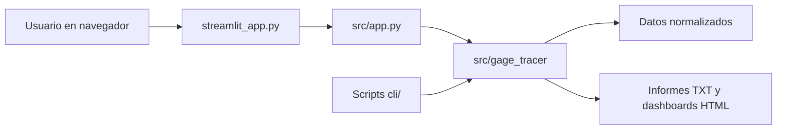

# Integrated MSA Suite

Data Tracer delivers Measurement System Analysis (MSA) workflows for Type 1 Gage Study, Paired T-Test, and crossed Gage R&R ANOVA evaluations. Each workflow supports raw input, structured data, text reports, and self-contained HTML dashboards.

## Repository Overview

- `streamlit_app.py` — Unified Streamlit entrypoint for interactive MSA workflows.
- `cli/Type_1_gage_handy_tool.py` — Standalone CLI for Type 1 Gage Study processing.
- `cli/Paired_T_Test_tool.py` — Standalone CLI for paired t-test comparison.
- `cli/Gage_RR_tool.py` — Standalone multireport CLI for crossed Gage R&R analysis.
- `src/app.py` — Streamlit application module with the core UI implementation.
- `src/gage_tracer/` — Core library with parsing, calculation, and dashboard rendering.
- `gage_type1/` — Structured output directories for Type 1 results.
- `paired_ttest/` — Structured output directories for Paired T-Test results.
- `gage_rr/` — Structured input and output directories for crossed Gage R&R results.
- `tests/` — Validation tests for key analytical components.

## Core del proyecto: `src`, `cli` y Streamlit

El proyecto separa la interfaz, las reglas de análisis y los puntos de entrada.
La carpeta `src/gage_tracer/` contiene el núcleo reutilizable; `src/app.py` y
los scripts de `cli/` coordinan ese núcleo para la interfaz web o para la
generación de archivos.



### Entrada de Streamlit

- `streamlit_app.py` es el lanzador principal documentado. Añade `src/` a la
	ruta de importación de Python, importa `main` desde `src/app.py` y lo ejecuta.
	No contiene cálculos estadísticos ni define las páginas.
- `src/app.py` construye la experiencia Streamlit: navegación entre Type 1,
	Paired T-Test y Gage R&R; carga de archivos; selección de formatos y opciones;
	presentación de tablas, métricas y gráficos; y descargas de resultados.
	Convierte los archivos cargados en flujos reutilizables y delega el análisis
	en `gage_tracer`.
- `cli/app.py` es un segundo lanzador de la misma aplicación web: ejecuta
	Streamlit apuntando directamente a `src/app.py`. No es uno de los tres CLI
	que generan informes estadísticos.

### Módulos de `src/gage_tracer/`

- `data_parser.py` lee los formatos de entrada y los convierte en tablas
	normalizadas. Contiene parsers distintos para Type 1, Gage R&R y los dos
	formatos del Paired T-Test; valida bloques, etiquetas y mediciones antes de
	que los análisis reciban los datos.
- `calculations.py` contiene los cálculos de Type 1 y Gage R&R. Para Type 1
	calcula métricas como bias, Cg y Cgk; para Gage R&R realiza el análisis ANOVA
	cruzado, estima componentes de variación, aplica la regla de interacción y
	obtiene métricas como porcentaje de Gage R&R y NDC.
- `paired_ttest.py` implementa la comparación de dos sistemas: alinea las
	observaciones, calcula la prueba t pareada y sus intervalos, genera
	diagnósticos y prepara resultados de overview con ajuste de Holm cuando se
	analizan varias características.
- `paired_visualization.py` construye las figuras estadísticas del Paired
	T-Test, incluidas las de resumen y diagnóstico.
- `visualization.py` genera los dashboards de Type 1 y Gage R&R, las vistas de
	overview y los paquetes HTML exportables.
- `presentation.py` adapta resultados a tablas, previews y estados listos para
	la interfaz. Mantiene ese formateo separado de los cálculos estadísticos.
- `study_config.py` concentra las reglas compartidas del diseño y los
	umbrales, como el diseño cruzado de 10 piezas, 3 operadores y 3 pruebas.
- `__init__.py` publica una API común para las funciones principales del
	paquete.

En conjunto, el recorrido de un análisis es: **entrada sin procesar → parser y
validación → cálculos → presentación o exportación**. Los parsers no deciden
cómo se muestra el resultado, y la interfaz no vuelve a implementar las
fórmulas.

### Responsabilidad de `cli/`

Los scripts CLI son orquestadores ejecutables desde una terminal. Preparan las
carpetas, localizan archivos de entrada, llaman al parser y a los cálculos, y
guardan los artefactos del estudio. Comparten `src/gage_tracer/`; no mantienen
una segunda implementación de las fórmulas.

- `cli/Type_1_gage_handy_tool.py` ejecuta el flujo Type 1: lee `RAW DATA.txt`,
	normaliza las mediciones, calcula cada dimensión y genera el resumen de texto
	y el dashboard HTML.
- `cli/Paired_T_Test_tool.py` ejecuta la comparación Sistema A/Sistema B. Acepta
	valores numéricos pareados o archivos con bloques de varias características;
	produce los datos pareados, los informes y dashboards, y el overview/ZIP para
	estudios multicaracterística.
- `cli/Gage_RR_tool.py` analiza los bloques de Gage R&R cruzado, calcula un
	análisis independiente por característica y genera sus informes y
	dashboards. Permite seleccionar cómo interpretar el orden de los bloques no
	etiquetados con `--report-order`.
- `cli/app.py` inicia la aplicación Streamlit desde la carpeta `cli/`; para
	abrir la interfaz, el punto de entrada principal sigue siendo
	`streamlit_app.py`.

Los CLI guardan los resultados en las carpetas propias de cada estudio
(`data/`, `reports/` y `dashboards/`). Streamlit, en cambio, procesa cargas en
memoria y permite descargar los resultados desde el navegador.

## Repository Standard

Every study follows the same directory convention:

- `raw/` — input files or versioned synthetic examples.
- `data/` — normalized TSV output generated by the pipeline.
- `reports/` — generated plain-text statistical summaries.
- `dashboards/` — generated HTML and PNG visual reports.
- `docs/` — study-specific usage and interpretation guides, when needed.
- `templates/` — reusable input templates for a specific study.

Generated files are ignored by Git; regenerate them from `raw/` inputs with the CLI or Streamlit app. Do not place production measurement data in version control.

## Layout

```text
.
├── LICENSE
├── README.md
├── requirements.txt
├── streamlit_app.py
├── cli/
│   ├── Gage_RR_tool.py
│   ├── Type_1_gage_handy_tool.py
│   └── Paired_T_Test_tool.py
├── src/
│   ├── app.py
│   └── gage_tracer/
│       ├── calculations.py
│       ├── data_parser.py
│       ├── paired_ttest.py
│       ├── visualization.py
│       └── __init__.py
├── gage_rr/
│   ├── raw/
│   ├── templates/
│   ├── data/
│   ├── reports/
│   ├── dashboards/
│   └── docs/
├── gage_type1/
│   ├── raw/
│   ├── data/
│   ├── reports/
│   └── dashboards/
├── paired_ttest/
│   ├── raw/
│   ├── data/
│   ├── reports/
│   ├── dashboards/
│   └── docs/
└── tests/
```

## Getting Started

### Interactive UI

Launch the portfolio-grade Streamlit application:

```bash
streamlit run streamlit_app.py
```

or with the selected Python interpreter:

```bash
python -m streamlit run streamlit_app.py
```

The UI provides:
- Dark-themed MSA workflow selection
- In-memory file upload support
- Live metric panels
- Exportable HTML dashboards

### CLI Workflows

#### Type 1 Gage Study
Place the raw measurement input and run:

```bash
python cli/Type_1_gage_handy_tool.py
```

#### Paired T-Test
Place the paired measurement files and run:

```bash
python cli/Paired_T_Test_tool.py
```

#### Gage R&R (Crossed)

Place the raw report file in `gage_rr/raw/GAGE RR DATA.txt` and run:

```bash
python cli/Gage_RR_tool.py
```

The input must form a balanced design:

$$\text{reports} = \text{operators} \times \text{parts} \times \text{trials}$$

Each characteristic in a report receives an independent Gage R&R analysis and its own report/dashboard pair.

For untagged report blocks, the order of the 90 reports determines the Part,
Operator, and Trial labels. The default is `part-major`
(`Part → Operator → Trial`); select `operator-major`
(`Operator → Part → Trial`) when that matches the collection sequence:

```bash
python cli/Gage_RR_tool.py --report-order operator-major
```

The Streamlit workflow provides the same sequence choice. Part-tagged single-dimension input derives the part from its tags.

After processing, the Gage R&R workflow opens with a study overview that summarizes the verdict, variation components, NDC, and interaction result for every characteristic. Download the overview on its own or as the first HTML file in the all-reports ZIP.

For the Paired T-Test, the CLI reads `PAIRED DATA SYSTEM A.txt` and
`PAIRED DATA SYSTEM B.txt` from `paired_ttest/raw/` (legacy root-level files are
still accepted). Single-characteristic files contain one finite number per
nonblank line. Multi-characteristic files use matching `:BEGIN`/`:END` blocks;
within each block, each row is `<characteristic><TAB><measurement>`, with
optional trailing GRR metadata fields ignored. Optional `PATTERN:`, `DISPLAY:`,
and `UNIT:` lines are allowed inside blocks. Both systems need at least two
blocks, the same block count and characteristic labels, and corresponding
observations in the same block order. Multi-characteristic studies open with an
overview and can export it with the per-characteristic dashboards.

## Notes

- This repo is intended for clean, production-like presentation.
- Temporary debug files have been removed.
- All documentation and artifacts are free of proprietary or corporate identifiers.
